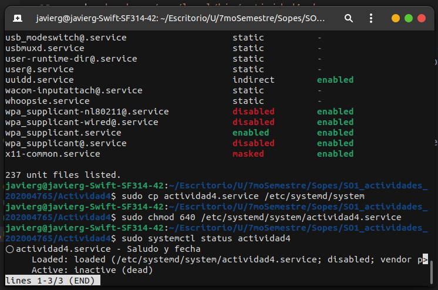
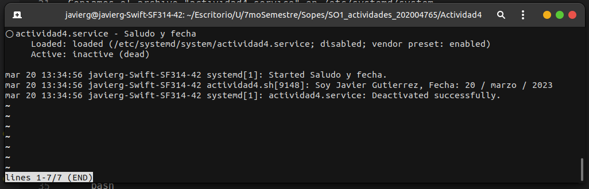

## Actividad 4

Copiamos el script en /usr/local/bin que es el sitio recomendado para la instalación de nuestros programas.

``` bash
sudo cp actividad4.sh /usr/local/bin
```

Debemos asegurarnos de que sea ejecutable.

``` bash
sudo chmod +x /usr/local/bin/actividad4.sh
```

Se debe crear un fichero de configuración del servicio dentro del directorio /etc/systemd/system/ pero debemos asegurarnos que no se esté utilizando el nombre "actividad4.service" que es el nombre utilizado.

``` bash
sudo systemctl list-unit-files --type=service
```

Copiamos el archivo "actividad4.service" en /etc/systemd/system

``` bash
sudo cp actividad4.service /etc/systemd/system
```

Modificamos los permisos

``` bash
sudo chmod 640 /etc/systemd/system/actividad4.service
```

Verificamos el status del servicio

``` bash
sudo systemctl status actividad4
```

Vemos que si existe pero está inactivo


Procedemos a iniciarlo

``` bash
sudo systemctl start actividad4
```

Vemos que ya se inició y se muestra el log del servicio

